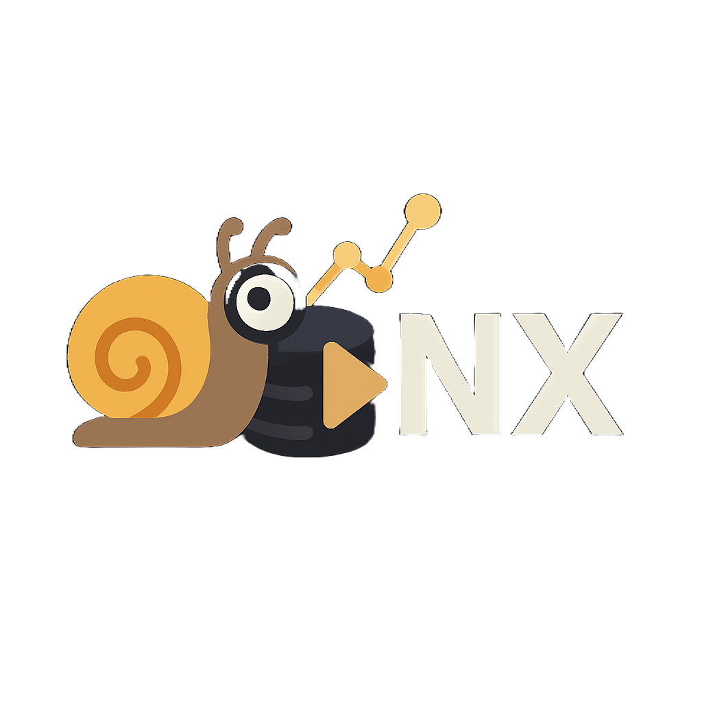
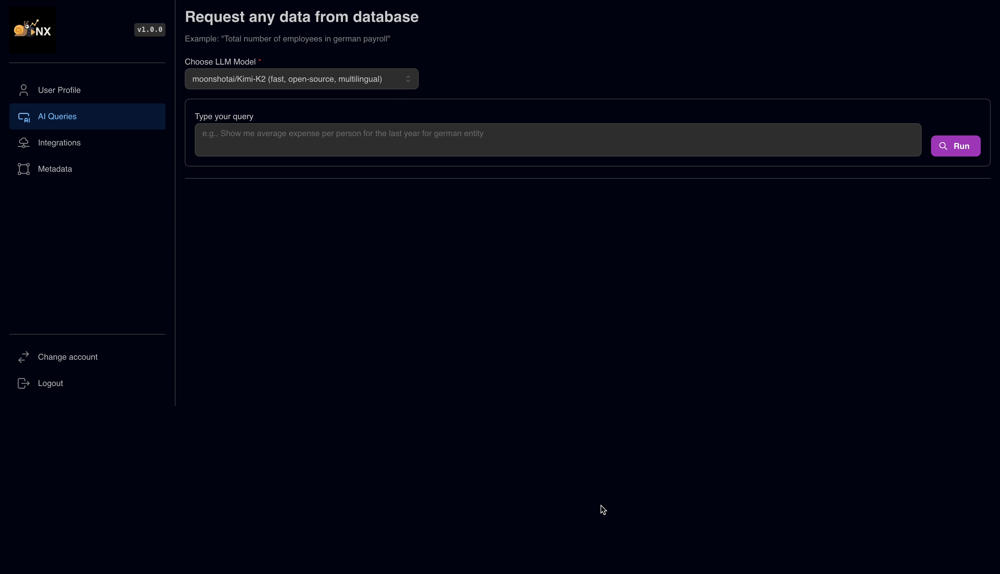
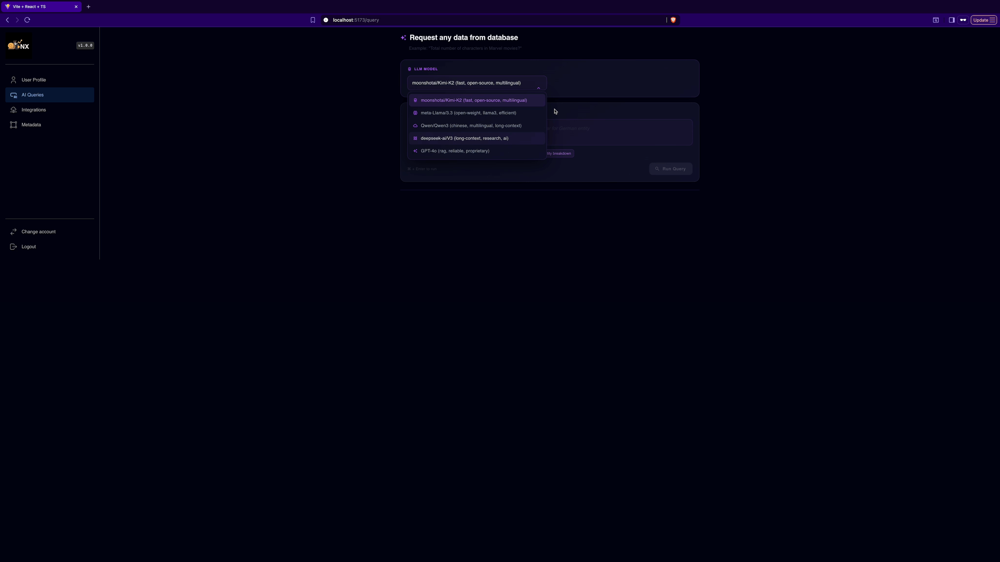
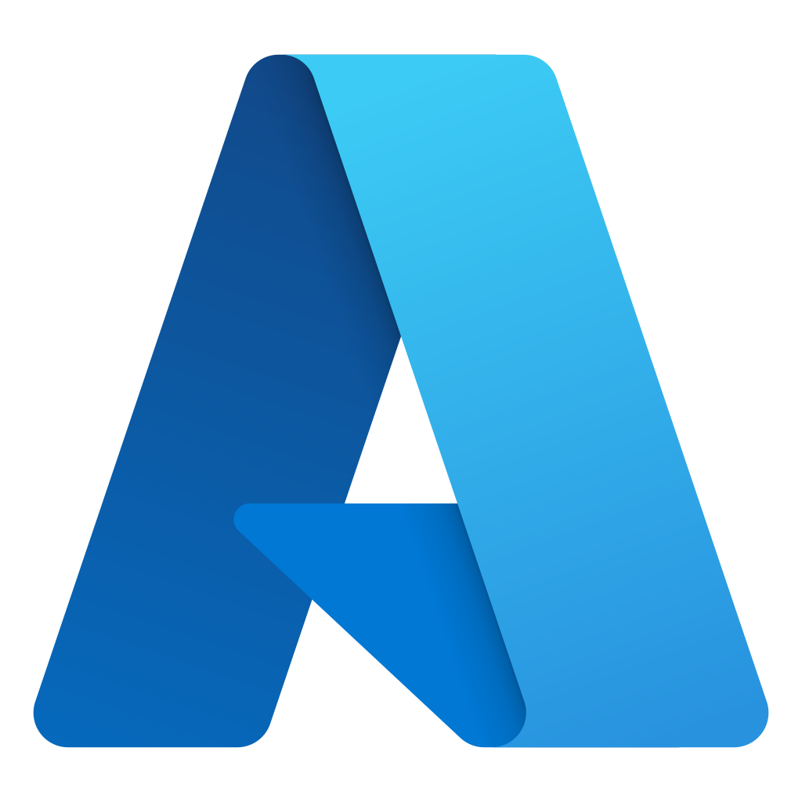
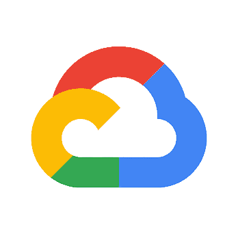
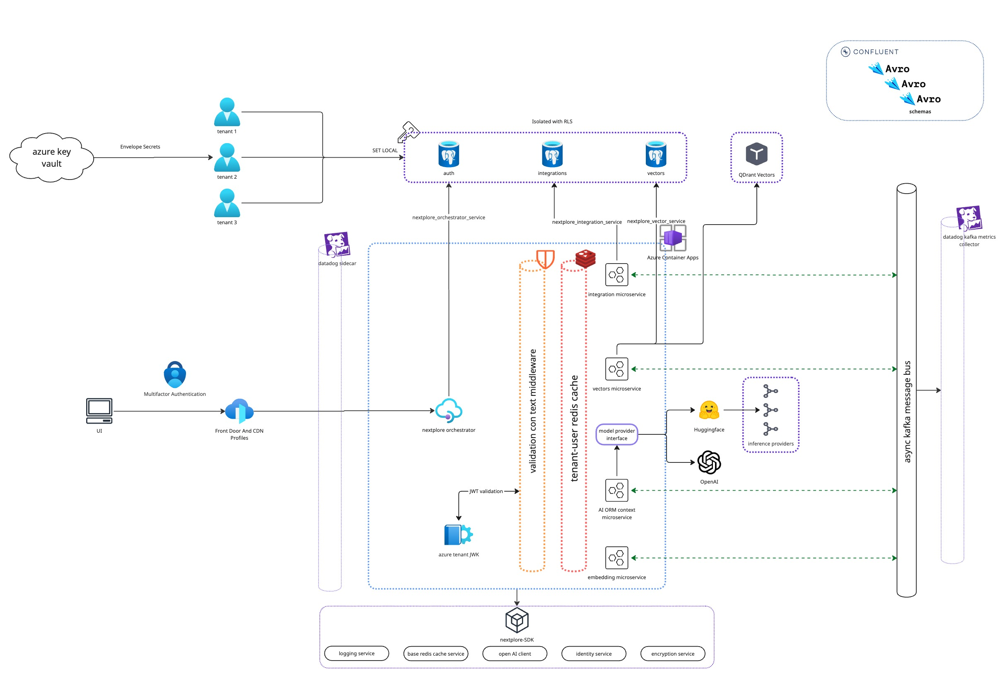

<p align="center">
  
</p>

<h1 align="center">Nextplore</h1>

<p align="center">
  AI-powered insights • Secure • Instant • Beautiful.
</p>

---

> ⚠️ **Status: WIP**  
> Nextplore is under active development. Interfaces and features may change without notice.

# Nextplore - LLM-powered SQL ORM Context Creator

> Nextplore is a multi-tenant microservice SaaS designed to leverage Large Language Models (LLMs) and advanced metaprogramming to enable general users or developers to interact with range of databases easily without knowing SQL language. It enables natural language querying across variety of database systems including Snowflake, MySQL, MSSQL and PostgreSQL. Nextplore supports different LLMs integrations including Deepseek, Qwen, meta-Llama and GPT-4o.

<p align="center">
  <a href="license.md"></a> <a href="https://github.com/unsigned-long-int/nextplore"></a> 
</p>

<p align="center">
     
</p>

---

**Table Of Contents**

- [Project Focus](#project-focus)
- [Demo](#demo)
- [Overview](#overview)
- [Features](#features)
- [Integrating](#integrating)
- [Architecture](#architecture)
- [Security](#security)
- [Links](#links)
- [Roadmap](#roadmap)

## Project Focus

Nextplore is a Retrieval-Augmented Generation (RAG) platform designed to provide structured access to enterprise data across heterogeneous data stores. It connects dynamically to multiple internal databases and enables unified querying and analysis of company knowledge.

The platform is strictly read-only and does not perform write operations on source systems, though future releases may introduce controlled data manipulation. Its focus is secure data retrieval, schema-aware exploration, and generation of structured insights from existing data assets. Nextplore delivers the greatest value when integrated with multiple data sources, acting as a centralized and consistent access layer for enterprise knowledge. 

## Demo

**Natural Language Querying**

Request any data across your integrations and get structured response.



**Pipeline Tracing**

Use multi-query retrieval to broaden semantic coverage, combined with Reciprocal Rank Fusion (RRF) for robust result aggregation. Leverage RAG trace instrumentation to gain visibility into context construction and retrieval effectiveness.



**Integration Creation/Update/Delete**

Create and manage your integrations. 


**Vectors Metadata View**

View and validate vectors used for RAG. 


**MFA Tenant Login**

Securely create and log in to your environment.


## Overview

Nextplore aims to enable developers or general users to interact with a variety of relational databases without the need to write any SQL queries. Under the hood it uses [`sqlalchemy`](https://docs.sqlalchemy.org/en/20/intro.html) to dynamically generate and query Object Relational Mapping ([ORMs](https://docs.sqlalchemy.org/en/20/orm/)) models.

Due to abstraction of [DBAPI](https://peps.python.org/pep-0249/) the interaction with range of databases becomes possible regardless of the internals of particular database dialects. Nextplore creates ORMs by leveraging [factory pattern](https://refactoring.guru/design-patterns/factory-method) applied together with [metaprogramming](https://www.geeksforgeeks.org/python/metaprogramming-metaclasses-python/). This is achieved by converting natural language responses into structured JSON output schema which serve as arguments for a variety of metafactories responsible for generating new ORMs.

Since databases may grow very large consisting of hundreds of schemas and tables, the metadata of tables are embedded and stored at [QDrant](https://qdrant.tech/). Respective metadata (i.e. integration, database, tables, schemas) is stored in PostgreSQL together with QDrant ID. This allows nextplore to apply [RAG](https://aws.amazon.com/what-is/retrieval-augmented-generation/) where only most relevant tables are used as basis for structured LLMs responses. The user natural language prompt is converted into vector, then cosine similarity is calculated between and **top N** vectors are matched as future knowledge source for chosen LLM.

## Features

### Natural language querying

**Nextplore** enables you to explore and interact with **any relational data** across multiple databases **without writing a single line of SQL**.

With AI-driven search, you can query **all available metadata** from your connected integrations using a **single, unified query**.

- Choose from a variety of powerful AI models:

  - **Moonshatai**
  - **DeepSeek**
  - **OpenAI**
  - **LlamA**

- **Unified search across integrations**  
  Query data across all connected databases in one go.

- **Pivot functions**  
  Built-in support for:

  - `AVG`, `SUM`, `COUNT`, `MAX`, `MIN`

- **Advanced filtering**  
  Supported operators:

  - `==`, `!=`, `>`, `<`, `>=`, `<=`, `LIKE`, `NOT LIKE`, `IN`

- **SQL transparency**  
  View the **exact SQL** generated for your request.

- **Data export**  
  Export selected results directly for further analysis.

- **Model flexibility**  
  Choose your preferred AI model for query processing.


### Integrations

**Nextplore** natively integrates with multiple database management systems (DBMS), including [Snowflake](https://www.snowflake.com/en/), [MySQL](https://www.mysql.com/), [MSSQL](https://www.microsoft.com/en/sql-server), [PostgreSQL](https://www.postgresql.org/). For authentication and authorization, it supports standards-based **Identity and Access Management (IAM)** integration with major cloud providers: Azure, AWS, and GCP - enabling secure, policy-driven access to managed services.

> :passport_control: **Authentication**  
> All connections are established over TLS with `TrustServerCertificate=false`, enforcing strict **X.509 certificate validation**. As a result, the server must present an SSL/TLS certificate issued by a publicly trusted **Certificate Authority (CA)**. Certificates signed by private or internal CAs are **not supported**.

> ⚠️ **Note 1**: To ensure end-to-end trust validation, **Nextplore** ships and maintains [CA bundles](https://docs.aws.amazon.com/AmazonRDS/latest/UserGuide/UsingWithRDS.SSL.html#UsingWithRDS.SSL.CertificatesDownload) across all **AWS** regions and [CA budnles](https://cloud.google.com/sql/docs/postgres/manage-ssl-instance) for all **GCP** regions.

> ⚠️ **Note 2**: Currently, Nextplore does not support private endpoints accessible only through customer VNets or VPNs.
> However, Nextplore guarantees static egress IPs, which allow you to safely expose your database endpoint to the public network while restricting inbound access exclusively to Nextplore's IP(s). It is recommended to configure your firewall or network security group to permit connections only from this address.
> :blush: **Exception**: For **GCP**-hosted instances **Nextplore** gives you possibility to avoid IP whitelisting via [Cloud Authentication Proxy Connectors](https://cloud.google.com/sql/docs/mysql/language-connectors) as described [here](#sql-native-authentication).

| DB         | Native Authentication (cloud-agnostic) | Cloud IAM: Azure  | Cloud IAM: AWS  | Cloud IAM: GCP  | Snowflake: Key-Pair  | Snowflake: Programmatic Access Token (PAT)  | Kerberos/Windows |
| ---------- | -------------------------------------- | ----------------------------------------------------------------------------------------- | ----------------------------------------------------------------------------------- | ----------------------------------------------------------------------------------- | ------------------------------------------------------------------------------------------------ | ----------------------------------------------------------------------------------------------------------------------- | ---------------- |
| SQL Server | ✅ (MSSQL's native pwd auth)           | ✅ (oAuth 2.0 - Client Secret / Certificate)                                              | ❌                                                                                  | ❌                                                                                  | ❌                                                                                               | ❌                                                                                                                      | ❌               |
| MySQL      | ✅ (MySQL's native pwd auth)           | ✅ (oAuth 2.0 - Client Secret / Certificate)                                              | ✅ (Assume Role with temp token)                                                    | ✅ (IAM DB Auth with Cloud Connector)                                               | ❌                                                                                               | ❌                                                                                                                      | ❌               |
| PostgreSQL | ✅ (PostgreSQL's native pwd auth)      | ✅ (oAuth 2.0 - Client Secret / Certificate)                                              | ✅ (Assume Role with temp token)                                                    | ✅ (IAM DB Auth with Cloud Connector)                                               | ❌                                                                                               | ❌                                                                                                                      | ❌               |
| Snowflake  | ✅ (Snowflake's pwd auth)              | ❌                                                                                        | ❌                                                                                  | ❌                                                                                  | ✅ (RSA with signed JWT)                                                                         | ✅ (With network and auth policy)                                                                                       | ❌               |

### Metadata overview

**Nextplore** provides a comprehensive view of the metadata associated with each integration.
It enables users to seamlessly inspect and validate active integrations, with a focus on the tables and columns most relevant for **Retrieval-Augmented Generation (RAG)** query resolution.

By exposing both system-defined and descriptive metadata (e.g., SQL Server _extended properties_, PostgreSQL `COMMENT` fields), the platform helps users identify where metadata should be refined or extended.

This refinement enables RAG pipelines to more accurately surface the correct datasets for user queries, ultimately improving both retrieval precision and interpretability of query results.

## Integrating

### SQL server

**Nextplore** supports multiple authentication methods for **SQL Server**:

- **SQL native authentication** with username/password.
- For servers hosted on Azure, you can use **Microsoft Entra (Azure AD) Service Principal authentication** with **oAuth 2.0**
- There is no **IAM auth** available for **AWS** and **GCP** for SQL Server.

#### Native authentication

To enable password authentication for instances hosted on **AWS** and **Azure**, you need to provide only host name, username and password. **Nextplore** automatically takes care of TLS via shared CA bundles.

By default, **GCP** exposes only a public IP address rather than a hostname, as described in the [official documentation](https://cloud.google.com/sql/docs/sqlserver/configure-ssl-instance).

To ensure TLS and a full CA verification, **Nextplore** provides 2 main ways to configure password authentication:

1. **Native Connection**

   To enable CA verification, **Nextplore** configures DNS resolution against the instance. This requires both the **public IP** address and the corresponding **DNS name** to be provided, ensuring that certificate validation can be performed automatically.

   To retrieve `DNS Name` follow these steps:

   - Authenticate using **gcloud CLI**
   - Execute the following [command](https://cloud.google.com/sdk/gcloud/reference/sql/instances/describe) (replace placeholders with your instance details):

   ```
   gcloud sql instances describe INSTANCE_NAME \
   --project=PROJECT_ID
   ```

   - Locate the `dnsName` field in the output. It will be in the following format:

   ```
   INSTANCE_UID.PROJECT_DNS_LABEL.REGION_NAME.sql.goog.
   ```

   In this case your connection stays encrypted and verifiable, but you need to additionally **whitelist** **Nextplore egress IP** in your firewall settings.

   When creating your integration with simple **auth** you need to provide the **following**:

   - host (your retrieved `dnsName` from **GCP**)
   - public IP
   - database
   - username
   - password

2. **gcloud Proxy Connection**

   **Nextplore** also provides implementation of engine creator via [GCP Cloud SQL Connector](https://cloud.google.com/sql/docs/postgres/connect-connectors) which overtakes encryption and removes the burden of managing firewall rules or SSL certificates manually. It means as long as your instance is hosted on Azure, you do not have to include **Nextplore egress IP** in your firewall whitelist.
   To do so, **Nextplore** runs **GCP** service account to which you need to give respective access rights. (similar to AWS role permissions)

   To enable **Connector Login**, follow these **steps**:

   - On **GCP** go to IAM -> Grant Access
   - Add **Nextplore GCP service account** and provide it with `Cloud SQL Client` role. (service account name will be shown on creation)

   When creating your integration with **GCP Cloud Connector** you need to provide the **following**:

   - host (your connection name from GCP instance)
   - database
   - username (for SQL login)
   - password (for SQL login)

#### IAM

Microsoft provides a very comprehensive [guide](https://learn.microsoft.com/en-gb/azure/azure-sql/database/authentication-aad-configure?view=azuresql&tabs=azure-portal) on how to connect with **oAuth 2.0** on Azure SQL Server.

> ⚠️ **Note:**
> With minor syntatic sugar differences the configuration of oAuth 2.0 on Azure is very similar for SQL Server, MySQL and PostgreSQL. For non-native DBMS logging in as initial admin is enabled via token auth.

1. Under your running Azure Server Instance, set **Microsoft Entra Admin** (_it will be used for initial connection and creating AAD users in SQL Server_)
2. Connect to your instance from **VSCode** or **ADS** with **Microsoft Entra Id - Universal with MFA Support** authentication type using your **Microsoft Entra Admin** account.
   - **ADS**:
     - left-bottom account corner
     - add linked accounts
     - log in via browser with MFA
   - **VSCode**
     - install mssql extension
     - go to SQL server
     - add connection
     - insert instance name of your SQL Server (your-instance.database.windows.net)
     - provide database name (optional)
     - choose authentication type **Microsoft Entra Id - Universal with MFA Support**
     - log in via browser with MFA
3. Register Application in Azure.
   - Ensure your service principal has `Directory Readers` role in Azure.
4. Create Microsoft Entra Principals in SQL.
   - Ensure microsoft entra principal name in SQL matches exactly the one you just registered.

```sql
CREATE USER [<Microsoft_Entra_principal_name>] FROM EXTERNAL PROVIDER;
```

5. You may want to restrict rights of the user to **SELECT-ONLY** and to certain schemas/tables that you want to query with **Nextplore** in the future.
6. Then you have 2 options:
   - **Client Secret** Auth:
     - Add secrets to your registered app
     - When creating integration on **Nextplore** just provide your client secret, tenant id, client id.
     - **Nextplore** will store them encrypted and will take care of [**oAuth 2.0**]
     - Note, that your client secrets will NOT be used in connection string and authentication will happen using temp byte token as described [here](https://learn.microsoft.com/en-us/sql/connect/odbc/using-azure-active-directory?view=sql-server-ver17#authenticating-with-an-access-token)
   - **Certificate** Auth:
     - Although **Nextplore** supports using secrets for oAuth 2.0, the use of those is **discouraged** due to exposure of secrets (for flexible servers) in connection strings and short-life nature of secrets.
     - It is highly advised to use Certificate authentication instead. Certificates are long-lived and provide much better way to authenticate.
     - If you choose authentication with Azure IAM via Certificate, **Nextplore** will generate certficate key pairs (RSA 3072) and store private key securely in AKV and provide you with public one.
     - Then you will just need to upload this public key to your registered app, so that it can verify JWT which Nextplore signed with private key.

### MySQL

**Nextplore** also supports different authentication methods for **MySQL**:

- **SQL Native authentication** with username/password (e.g. `caching_sha2_password` or `mysql_native_password`).
- For **Azure Database** for MySQL, you can also enable **OAuth 2.0** authentication.
- For **Aurora and RDS** on AWS, you can also enable **IAM** connection with temporary tokens via [Role Assumption Policy](https://docs.aws.amazon.com/STS/latest/APIReference/API_AssumeRole.html).
- For **GCP**, you have the possibility to connect with **IAM** authentication with temporary tokens via [Cloud Connector](https://cloud.google.com/sql/docs/postgres/iam-logins).

#### Native authentication

To enable password authentication for instances hosted on **AWS** and **Azure**, you need to provide only host name, username and password. **Nextplore** automatically takes care of TLS via shared CA bundles.

By default, **GCP** exposes only a public IP address rather than a hostname, as described in the [official documentation](https://cloud.google.com/sql/docs/sqlserver/configure-ssl-instance).

To ensure TLS and a full CA verification, **Nextplore** provides 2 main ways to configure password authentication:

1. **Native Connection**

   To enable CA verification, **Nextplore** configures DNS resolution against the instance. This requires both the **public IP** address and the corresponding **DNS name** to be provided, ensuring that certificate validation can be performed automatically.

   To retrieve `DNS Name` follow these steps:

   - Authenticate using **gcloud CLI**
   - Execute the following [command](https://cloud.google.com/sdk/gcloud/reference/sql/instances/describe) (replace placeholders with your instance details):

   ```
   gcloud sql instances describe INSTANCE_NAME \
   --project=PROJECT_ID
   ```

   - Locate the `dnsName` field in the output. It will be in the following format:

   ```
   INSTANCE_UID.PROJECT_DNS_LABEL.REGION_NAME.sql.goog.
   ```

   In this case your connection stays encrypted and verifiable, but you need to additionally **whitelist** **Nextplore egress IP** in your firewall settings.

   When creating your integration with simple **auth** you need to provide the **following**:

   - host (your retrieved `dnsName` from **GCP**)
   - public IP
   - database
   - username
   - password

2. **gcloud Proxy Connection**

   **Nextplore** also provides implementation of engine creator via [GCP Cloud SQL Connector](https://cloud.google.com/sql/docs/postgres/connect-connectors) which overtakes encryption and removes the burden of managing firewall rules or SSL certificates manually. It means as long as your instance is hosted on Azure, you do not have to include **Nextplore egress IP** in your firewall whitelist.
   To do so, **Nextplore** runs **GCP** service account to which you need to give respective access rights. (similar to AWS role permissions)

   To enable **Connector Login**, follow the following **steps**:

   - On **GCP** go to IAM -> Grant Access
   - Add **Nextplore GCP service account** and provide it with `Cloud SQL Client` role. (service account name will be shown on creation)

   When creating your integration with **GCP Cloud Connector** you need to provide the **following**:

   - host (your connection name from GCP instance)
   - database
   - username (for SQL login)
   - password (for SQL login)

#### IAM Azure

To enable **oAuth 2.0** authentication for **MySQL** on Azure, follow these steps:

1. Create (if not done already) MySQL instance on Azure for **MySQL** flexible servers.
2. Create **user managed identity** ([UMI](https://learn.microsoft.com/en-us/entra/identity/managed-identities-azure-resources/how-manage-user-assigned-managed-identities?pivots=identity-mi-methods-azp)).
3. Assign following privelleges to UMI:
   - User.Read.All
   - GroupMember.Read.All
   - Application.Read.ALL
4. Set Microsoft Entra Admin (same as by SQL Server)
5. Enable either **Microsoft Entra authentication only** or **MySQL and Microsoft Entra authentication** under Authentication in your MySQL instance on Azure.
6. Once enabled, Microsoft Entra admin may log in and create AAD users for connections. (in our case AAD user will be service principal)
7. Register application if not done -> this will be used as AAD user for connection.
8. Unlike SQL Server where connection was performed interactively through ADS or VSCODE, for initial login as admin you need to provide a valid access token as password yourself.
9. To do so get token in Azure CLI like this:
   - log in to azure via browser and choose/confirm your subscription:
     `az login`
   - once confirmed and logged in fetch the token into TOKEN variable:
     `TOKEN=$(az account get-access-token --resource-type oss-rdbms -o tsv --query accessToken)`
   - now you may go to **MySQL Workbench** and insert obtained token as password and your your Entra Admin as user name (for other ways to initially connect, check the [guide](https://learn.microsoft.com/en-us/azure/mysql/flexible-server/how-to-azure-ad)).
10. When you are inside MySQL, create the AAD user with this statement:

```sql
CREATE AADUSER '<service_principal_name>';
```

11. You may want to restrict rights of the user to **SELECT-ONLY** and to certain schemas/tables that you want to query with **Nextplore** in the future.
12. Again, oAuth 2.0 access to the service principal may be configured via secret or certificate with the latter being preferred method.

Here is also a microsoft [guide](https://learn.microsoft.com/en-us/azure/mysql/flexible-server/how-to-azure-ad) on the same.

#### IAM AWS

To enable **IAM** authentication on AWS, follow these steps:

1. Create (if not done already) MySQL instance on **AWS**.
2. Connect to MySQL (e.g. via MySQL Workbench) with your admin account (_you should have created this when making the instance_)
3. Create user for future connection:
   Here, again you may want to restrict what **Nextplore** service may access in your DB.
4. In MySQL **IAM access** is provided by [AWSAuthenticationPlugin](https://docs.aws.amazon.com/AmazonRDS/latest/UserGuide/UsingWithRDS.IAMDBAuth.DBAccounts.html)

```sql
-- create user identified with AWSAuthenticationPlugin which will handle IAM token auth
CREATE USER 'test_user'@'%' IDENTIFIED WITH AWSAuthenticationPlugin AS 'RDS';

-- GRANT least privelege access to DB or retrict further to schemas
GRANT SELECT ON your_database.* TO 'test_user'@'%';
```

5. Create **IAM** policy for `test_user`:

**Example: IAM Policy**

```json
{
  "Version": "2012-10-17",
  "Statement": [
    {
      "Effect": "Allow",
      "Action": "rds-db:connect",
      "Resource": "arn:aws:rds-db:<REGION>:<ACCOUNT_ID>:dbuser:<RESOURCE-ID>/test_user"
    }
  ]
}
```

**`REGION`**: region of your DB.
**`ACCOUNT_ID`**: your account ID.
**`RESOURCE-ID`**: resource id of your DB instance.

6. Since **Nextplore** uses **Role Assumption** for AWS IAM, you need to create role to set up the permission policy for AWS **Nextplore** account with your DB user.

> ⚠️ **Note:**:
>
> - **Nextplore** uses AWS Service - `ec2.amazonaws.com` - under **`NextploreExecutionRole`** for accessing your DB instance. So in your permission policy, you should name principal accordingly (see example below).
> - **Nextplore** also validates the role names it is allowed to assume. So please ensure arn follows this naming convention: **`arn:aws:iam::<YOUR_ACCOUNT_ID>:role/NextploreRdsAccessRole`**.

**Example: Trust Policy**

```json
{
  "Version": "2012-10-17",
  "Statement": [
    {
      "Effect": "Allow",
      "Principal": {
        "AWS": "arn:aws:iam::<NEXTPLORE_SAAS_AWS_ACCOUNT_ID>:role/NextploreExecutionRole"
      },
      "Action": "sts:AssumeRole",
      "Condition": {
        "StringEquals": {
          "sts:ExternalId": "<EXTERNAL_ID>"
        }
      }
    }
  ]
}
```

**`NEXTPLORE_SAAS_AWS_ACCOUNT_ID`**: Nextplore AWS Account

- we will provide you with this when you create your integration

**`EXTERNAL_ID`**: Unique connection id for Nextplore (declared in trust policy you created). 

7. Attach **IAM policy** as permission from `test_user` (_created in Step 4_) to the role you just created.

#### IAM GPC

To enable **IAM** authentication on GCP, follow these steps:

1. Create (if not done already) managed MySQL instance on **GCP**.
2. During creation make sure to set `Public IP` in the IP instance assignment and `cloudsql_iam_authentication(on)` flag.
3. Go to IAM -> Grant Access and add provided **Nextplore GCP Service Account** and assign both `Cloud SQL Client` and `Cloud SQL Instance` roles.
4. After instance is provisioned, make sure to set `Allow only SSL connections` under Connections -> Security.
5. Go to Users -> Add User Account -> Cloud IAM and enter **Nextplore GCP Service Account**.
6. Connect to your instance with admin you set when creating the instance.
7. Assign the least privilege access to the **Nextplore GCP Service Account** user.

> ⚠️ **Note:**:
> **GCP** shortens the service account name when creating user to ensure it does not exceed user name length limits. So service account `nextplore-service@nextplore-123.iam.gserviceaccount.com` becomes just `nextplore-service@nextplore-123.iam`. This is the account you need to provide SQL access to.

**Example MySQL Login Access Provision**:

```sql
-- GRANT least privilege access to DB or restrict further to schemas
GRANT SELECT ON your_database.* TO 'nextplore-service@nextplore-123.iam';
```

### PostgreSQL

**Nextplore** provides multiple authentication methods for **PostgreSQL**:

- **Native authentication** with username/password.
- For **Azure Database** for PostgreSQL, you can also enable **OAuth 2.0** authentication.
- For **Aurora and RDS** on AWS, you can also enable **IAM** connection with temporary tokens via [Role Assumption](https://docs.aws.amazon.com/STS/latest/APIReference/API_AssumeRole.html).

#### Native authentication

To enable password authentication for instances hosted on **AWS** and **Azure**, you need to provide only host name, username and password. **Nextplore** automatically takes care of TLS via shared CA bundles.

By default, **GCP** exposes only a public IP address rather than a hostname, as described in the [official documentation](https://cloud.google.com/sql/docs/sqlserver/configure-ssl-instance).

To ensure TLS and a full CA verification, **Nextplore** provides 2 main ways to configure password authentication:

1. **Native Connection**

   To enable CA verification, **Nextplore** configures DNS resolution against the instance. This requires both the **public IP** address and the corresponding **DNS name** to be provided, ensuring that certificate validation can be performed automatically.

   To retrieve `DNS Name` follow these steps:

   - Authenticate using **gcloud CLI**
   - Execute the following [command](https://cloud.google.com/sdk/gcloud/reference/sql/instances/describe) (replace placeholders with your instance details):

   ```
   gcloud sql instances describe INSTANCE_NAME \
   --project=PROJECT_ID
   ```

   - Locate the `dnsName` field in the output. It will be in the following format:

   ```
   INSTANCE_UID.PROJECT_DNS_LABEL.REGION_NAME.sql.goog.
   ```

   In this case your connection stays encrypted and verifiable, but you need to additionally **whitelist** **Nextplore egress IP** in your firewall settings.

   When creating your integration with simple **auth** you need to provide the **following**:

   - host (your retrieved `dnsName` from **GCP**)
   - public IP
   - database
   - username
   - password

2. **gcloud Proxy Connection**

   **Nextplore** also provides implementation of engine creator via [GCP Cloud SQL Connector](https://cloud.google.com/sql/docs/postgres/connect-connectors) which overtakes encryption and removes the burden of managing firewall rules or SSL certificates manually. It means as long as your instance is hosted on Azure, you do not have to include **Nextplore egress IP** in your firewall whitelist.
   To do so, **Nextplore** runs **GCP** service account to which you need to give respective access rights. (similar to AWS role permissions)

   To enable **Connector Login**, follow the following **steps**:

   - On **GCP** go to IAM -> Grant Access
   - Add **Nextplore GCP service account** and provide it with `Cloud SQL Client` role. (service account name will be shown on creation)

   When creating your integration with **GCP Cloud Connector** you need to provide the **following**:

   - host (your connection name from GCP instance)
   - database
   - username (for SQL login)
   - password (for SQL login)

#### IAM Azure

To use **oAuth 2.0** flow with Microsoft Entra, please follow these steps:

1. Create (if not already done) **PostgreSQL** instance on Azure for flexible servers.
2. Set **Microsoft Entra Admin(s)** for initial authentication and AD users creation (unlike MySQL, multiple admins are possible here).
3. Register you application with `your-sp-name`.
4. Obtain the login admin token the same way as described in **MySQL step 9** above.
5. Use this token in **pgAdmin** to connect.
6. For your registered application run the following **statement**:

```sql
SELECT * FROM pg_catalog.pgaadauth_create_principal_with_oid(
    'your-sp-name',
    'your-sp-object-id',
    'service', -- type 'user', 'group' or 'service'
    false, -- not external - since sp is native principal to your tenant
    false -- not federated - since bult in and no federated IDP
)
```

7. Again here, enable app authentication either with **secret** or **certificate** (preferred).

For more info you can refer to this [guide](https://learn.microsoft.com/en-us/azure/postgresql/flexible-server/security-entra-configure).

#### IAM AWS

To connect via **IAM** in AWS, follow these steps:

1. Create **PostgreSQL** instance on AWS under if not done.
2. Connect to **PostgreSQL** (e.g. via pgAdmin or psql) with your admin account (_you should have created this when making the instance_)
3. Create user for future connection:
   Here, again you may want to restrict what **Nextplore** service may access in your DB.
4. In **PostgreSQL** you need to grant **rds_iam** role to the user for **IAM** authentication.

```sql
CREATE USER test_user WITH LOGIN;

GRANT rds_iam TO test_user;

GRANT CONNECT ON DATABASE starwars_universe TO test_user;
GRANT USAGE ON SCHEMA death_star TO test_user;
GRANT SELECT ON ALL TABLES IN SCHEMA death_star TO test_user;
ALTER DEFAULT PRIVILEGES IN SCHEMA death_star GRANT SELECT ON TABLES TO test_user;
```

5. Create **IAM** policy for `test_user`:

**Example: IAM Policy**

```json
{
  "Version": "2012-10-17",
  "Statement": [
    {
      "Effect": "Allow",
      "Action": "rds-db:connect",
      "Resource": "arn:aws:rds-db:<REGION>:<ACCOUNT_ID>:dbuser:<RESOURCE-ID>/test_user"
    }
  ]
}
```

**`REGION`**: region of your DB.
**`ACCOUNT_ID`**: your account ID.
**`RESOURCE-ID`**: resource id of your DB instance.

6. Since **Nextplore** uses **Role Assumption** you need to create role to set up the trust relationship with AWS **Nextplore** account.

> ⚠️ **Note:**:
>
> - **Nextplore** uses AWS Service - `ec2.amazonaws.com` - under **`NextploreExecutionRole`** for accessing your DB instance. So in your permission policy, you should name principal accordingly (see example below).
> - **Nextplore** also validates the role names it is allowed to assume. So please ensure arn follows this naming convention: **`arn:aws:iam::<YOUR_ACCOUNT_ID>:role/NextploreRdsAccessRole`**.

**Example: Trust Policy**

```json
{
  "Version": "2012-10-17",
  "Statement": [
    {
      "Effect": "Allow",
      "Principal": {
        "AWS": "arn:aws:iam::<NEXTPLORE_SAAS_AWS_ACCOUNT_ID>:role/NextploreExecutionRole"
      },
      "Action": "sts:AssumeRole",
      "Condition": {
        "StringEquals": {
          "sts:ExternalId": "<EXTERNAL_ID>"
        }
      }
    }
  ]
}
```

**`NEXTPLORE_SAAS_AWS_ACCOUNT_ID`**: Nextplore AWS Account

- we will provide you with this when you create your integration

**`EXTERNAL_ID`**: Unique connection id for Nextplore

- we will provide you with this when you create your integration

7. Attach **IAM policy** as permission from `test_user` (_created in Step 4_) to the role you just created.

#### IAM GPC

To enable **IAM** authentication on GCP, follow these steps:

1. Create (if not done already) managed PostgreSQL instance on **GCP**.
2. During creation make sure to set `Public IP` in the IP instance assignment and `cloudsql_iam_authentication(on)` flag.
3. Go to IAM -> Grant Access and add provided **Nextplore GCP Service Account** and assign both `Cloud SQL Client` and `Cloud SQL Instance` roles.
4. After instance is provisioned, make sure to set `Allow only SSL connections` under Connections -> Security.
5. Go to Users -> Add User Account -> Cloud IAM and enter **Nextplore GCP Service Account**.
6. Connect to your instance with admin you set when creating the instance.
7. Assign the least privelege access to the **Nextplore GCP Service Account** user in the database.

> ⚠️ **Note:**:
> **GCP** shortens the service account name when creating user to ensure it does not exceed user name length limits. So service account `nextplore-service@nextplore-123.iam.gserviceaccount.com` becomes just `nextplore-service@nextplore-123.iam`. This is the account you need to provide SQL access to.

**Example PostgreSQL Login Access Provision**:

```sql

GRANT CONNECT ON DATABASE hogwarts to "nextplore-service@nextplore-123.iam"
GRANT USAGE ON SCHEMA public to "nextplore-service@nextplore-123.iam"
GRANT SELECT ON ALL TABLES IN SCHEMA public to "nextplore-service@nextplore-123.iam"
ALTER DEFAULT PRIVILEGES IN SCHEMA public
GRANT SELECT ON TABLES TO "nextplore-service@nextplore-123.iam"
```

### Snowflake

**Nextplore** provides multiple authentication methods for **Snowflake**:

- **Native authentication** with username/password.
- **[Key-pair (RSA) Auth](https://docs.snowflake.com/en/user-guide/key-pair-auth)** with public/private keys.
- **[Programmatic Access Token (PAT)](https://docs.snowflake.com/en/user-guide/programmatic-access-tokens)** with temporary tokens.

#### Native authentication

To enable native authentication you can easily create role (with least desired priveleges and provide username and user password in your integrations credentials).
**Nextplore** highly recommends you to enable additional network policy for the user and whitelist Nextplore public IP only.

Here is a code sample which you can quickly run in your [Snowsight](https://docs.snowflake.com/en/user-guide/ui-snowsight).

```sql
CREATE ROLE NEXTPLORE_SERVICE;

GRANT USAGE ON WAREHOUSE <YOUR-WAREHOUSE> TO ROLE NEXTPLORE_SERVICE;
GRANT USAGE ON DATABASE <YOUR-DATABASE> TO ROLE NEXTPLORE_SERVICE;
GRANT USAGE ON SCHEMA <YOUR-SCHEMA> TO ROLE NEXTPLORE_SERVICE;

GRANT SELECT ON ALL TABLES IN SCHEMA <YOUR-SCHEMA> TO ROLE NEXTPLORE_SERVICE;
GRANT SELECT ON FUTURE TABLES IN SCHEMA <YOUR-SCHEMA> TO ROLE NEXTPLORE_SERVICE; -- if you want Nextplore to synchronise changes for future tables as well

CREATE USER NEXTPLORE_USER PASSWORD='NotEasyToGuess!' MUST_CHANGE_PASSWORD=FALSE
DEFAULT_ROLE = NEXTPLORE_SERVICE
DEFAULT_WAREHOUSE=<YOUR-WAREHOUSE>
DEFAULT_NAMESPACE=<YOUR-DATABASE>.<YOUR-SCHEMA>

-- create and set network policy for the user
CREATE OR REPLACE NETWORK POLICY nextplore_only
ALLOWED_IP_LIST = (<nextplore-public-ip>)

ALTER USER NEXTPLORE_PWD SET NETWORK_POLICY = NEXTPLORE_USER;

```

#### Key-pair (RSA)

**Nextplore** supports **key-pair authentication** for secure user access to **Snowflake**. When this method is enabled, **Nextplore** generates a **RSA key-pair** and provides the corresponding **public key (.pub)**, which must be registered with the designated Snowflake user account. The **private key** is securely stored in **Azure Key Vault (AKV)**, where it remains encrypted at rest.

During authentication, **Nextplore** leverages the private key to sign **JWT**, which is subsequently validated against the public key associated with the Snowflake user. This ensures a secure, asymmetric cryptographic validation process, aligning with Snowflake's recommended best practices.

Provided that you have created user and role with least privelege access, the following code snippet can be executed directly in [Snowsight](https://docs.snowflake.com/en/user-guide/ui-snowsight) to configure the user with provided public key.

```sql
GRANT MODIFY PROGRAMMATIC AUTHENTICATION METHODS ON USER <NEXTPLORE-USER>
  TO ROLE <NEXTPLORE-ROLE>;

ALTER USER NEXTPLORE_PWD SET RSA_PUBLIC_KEY='<.pub key provided by Nextplore>';
```

#### Programmatic access token (PAT)

**Nextplore** provides you with possibility to use also PAT for authentication in Snowflake. **Nextplore** discourages this though, since tokens are short-lived and need to be rotated. Use those when you want a quick test for a particular small set of data.

To use **PAT**, you need to fullfil **network access policy** (overridable but not recommended) and **authentication policy** requirements as described in [official documenation](https://docs.snowflake.com/en/user-guide/programmatic-access-tokens).

Here is a **code sample** how you can configure **PAT** on snowflake:

```sql
-- create and set network policy for the user
CREATE OR REPLACE NETWORK POLICY nextplore_only
ALLOWED_IP_LIST = (<nextplore-public-ip>)

ALTER USER NEXTPLORE_PWD SET NETWORK_POLICY = NEXTPLORE_USER;

CREATE AUTHENTICATION POLICY nextplore_auth
    PAT_POLICY=(
        NETWORK_POLICY_EVALUATION = ENFORCED_REQUIRED
        DEFAULT_EXPIRY_IN_DAYS = 15, -- expiration default for PAT
        MAX_EXPIRY_IN_DAYS = 90); -- cap max allowed lifetime for PAT


ALTER USER NEXTPLORE_PWD
ADD PROGRAMMATIC ACCESS TOKEN NEXTPLORE_PAT
DAYS_TO_EXPIRY = 30; -- copy paste token and insert as password in your integration
```

---

> ⚠️ **Note:**
> To enable more robust integration experience, it is planned to add gateway agent for **Kerberos** in the next releases.

---

## Architecture

The image below provides the basic architecture of the application.



**Tenant Isolation**

- For tenant isolation [RLS](https://www.postgresql.org/docs/current/ddl-rowsecurity.html) approach in a single database has been implemented (enough for MVP and small number of vendors, per-tenant-db and automatic provision should be implemented to avoid [noisy neighbour problem](https://learn.microsoft.com/en-us/azure/architecture/antipatterns/noisy-neighbor/noisy-neighbor) if bigger tenants are coming)
- To secure sensitive data (i.e. integration credentials) automatic provision of Azure Vault Store for [secret envelope](https://medium.com/@tarangchikhalia/envelope-encryption-a-secure-approach-to-secrets-management-c8abce5b24d2) has been built.
- Tenant isolation is achieved also with redis key validation, where sha256 keys always take unique user UUID and tenant UUID generated by backend database.
- To ensure only authenticated users reach microservices endpoints, JWT validation (with caching) is performed via middleware where user credentials are validated and context is set per user identity.
- Each of event sent by kafka follows the interface requiring to contain reference to user identity. Kafka events contain headers which allow message bus to partition them by tenant.

**Services Isolation**

- Each microservice is provisioned with a dedicated PostgreSQL role, scoped with the principle of least privilege. Access is strictly limited to the schemas relevant to the service's domain, ensuring data segregation, minimizing blast radius, and supporting multi-tenant security requirements.
- Inter-service communication follows an event-driven architecture implemented on Apache Kafka. To maintain strict, language-agnostic contract guarantees, producing services register and version AVRO schemas in the Confluent Schema Registry. This ensures schema evolution compatibility and prevents consumer-producer contract drift.
- Kafka messages are transmitted in a compact, byte-encoded format, minimizing payload size and network overhead. Serialization and deserialization are handled via the AVRO-based implementation of the Codec interface, enabling a modular serialization layer. This design allows for seamless substitution with alternative serialization mechanisms such as Protocol Buffers or JSON without impacting upstream or downstream service logic.
- Kafka messages are partitioned by tenant-id to guarantee ordered delivery and consistent event processing within each tenant's scope.

**Logging/Analytics**

- Logging can be configured via `.conf` files per microservice. 
- Logging provides json-formatted information on runtime state. It enables integrations with log analytics agents such as Datadog to collect, analyse and manage state of the application. 
- API performance metrics are collected and analysed via [prometheus](https://prometheus.io/)

**LLMs integrations**

- Integration microservice uses Hugging Face as inference provider solution to integrate with LLMs. 
- Since Hugging Face supports creation and inference of own model, Nextplore will support usage of own models for natural language querying.

**Microservice communication** 

- Nextplore offloads asynchronous requests to run via kafka message queue, thus allowing certain background jobs to run in parallel with other user activities.
- Synchronous, blocking interactions are handled via RESTful HTTP APIs.
- Some background jobs like syncing and etc. are run serverless at regular intervalls.

**Storage**

- Relational structured data is stored in PostgreSQL. This applies to authentication and structured metadata. 
- Embeddings used for RAG are stored in QDrant together with references to structured metadata.

## Security

Given the importance and sensitivity of company's internal information, Nextplore takes all possible precautious measures to secure the data and minimise the exposure at each step. 

Nextplore uses only metadata it may find on integrated data stores without having access to the content itself. You are encouraged to limit access rights as described in [integrating](#integrating) section. 

Sensitive data used for authentication is secured via envelope encryption. Each vendor is provisioned with a dedicated azure key vault where key encryption key (KEK). For each created integration random data encryption key (DEK) is generated. DEK is used to encrypt the data. DEK itself is then encrypted and stored per integration. Encrypted DEK itself is used unless unwrapped with KEK with a personal vendor vault.

To identify vulnerabilities, both source code, dependencies and container images are continuously scanned using Veracode. Container images are immutable, versioned, and stored in a private JFrog container registry. Code quality and maintainability are enforced through continuous static analysis via SonarQube integration.


## Links
[License](./license.md)
[Personal Website](www.unsigned-long-int.co)

## Roadmap

> Future releases will include support for **Snowflake** and **client agents** for Kerberos authentication.
